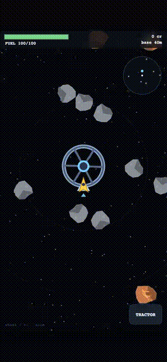

# SPACE HAULER

A 2.5D burst-impulse space mining / hauling / combat game in a single self-contained HTML file. Mine asteroids, tow scrap, outfit your ship, run trade convoys, capture outposts, land on planets, and carve out an empire across a 12k-unit starfield — all on canvas, mobile-friendly (drag to aim + thrust).



## Play

Hosted via GitHub Pages: **https://erikware.github.io/space_hauler/**
(Settings → Pages → Deploy from branch → `main` / root, if not yet enabled.)

Or run locally — sprites load at runtime, so serve over HTTP rather than opening the file directly:

```sh
python3 -m http.server 8000
# then open http://localhost:8000/
```

## Build

`game.html` is generated from `src/` by simple concatenation — no build tooling, no dependencies:

```sh
python3 build.py          # src/**/*.js → game.html
python3 build.py --check  # build, then run the headless selfTest in Node
```

The committed `game.html` is the playable build; rebuild it after touching anything in `src/`.

## Layout

| Path | What it is |
|---|---|
| `game.html` | The playable build (committed — this is what gets hosted) |
| `index.html` | Redirect → `game.html` for GitHub Pages |
| `src/` | Game source: nine Forge engine modules + game systems, concatenated in load order by `build.py` |
| `sprites/` | Runtime art (PNGs fetched by `game.html`) + the AI sprite-generation pipeline (`pipeline.py`) |
| `sprites/mira/` | Planet-surface tile/building/prop art for the Mira planet engine |
| `*.md` | Design specs, roadmap, and the development ledger |

Missing sprite PNGs are never fatal — every draw site falls back to procedural canvas art (`src/game/sprites.js` gates `GAMEPLAY_SPRITES`).
